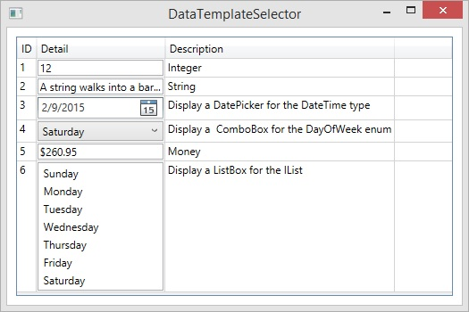

#Dynamic Cell Type for DataGrid

<code>

	public class DataItem
	{
	    public int ID { get; set; }
	
	    private dynamic _value;
	
	    public dynamic Value
	    {
	        get { return _value; }
	        set { _value = value; }
	    }
	
	    public string Description { get; set; }
	
	    public string[] DayOfWeekArray { get { return Enum.GetNames(typeof(DayOfWeek)); } }
	}

</code>
<code>

	public class CellDataTemplateSelector : DataTemplateSelector
    {
        public DataTemplate StringTemplate { get; set; }

        public DataTemplate DateTimeTemplate { get; set; }

        public DataTemplate DayOfWeekTemplate { get; set; }

        public DataTemplate MoneyTemplate { get; set; }

        public DataTemplate ListTemplate { get; set; }

        public override DataTemplate SelectTemplate(object item, DependencyObject container)
        {
            if ((item != null) && (item is DataItem))
            {
                DataItem dataItem = item as DataItem;
                if (dataItem.Value is int)
                {
                    return StringTemplate;
                }
                else if (dataItem.Value is string)
                {
                    return StringTemplate;
                }
                else if (dataItem.Value is DateTime)
                {
                    return DateTimeTemplate;
                }
                else if (dataItem.Value is DayOfWeek)
                {
                    return DayOfWeekTemplate;
                }
                else if (dataItem.Value is decimal)
                {
                    return MoneyTemplate;
                }
                else if (dataItem.Value is IList)
                {
                    return ListTemplate;
                }
                else
                {
                    return base.SelectTemplate(item, container);
                }
            }
            else
            {
                return base.SelectTemplate(item, container);
            }
        }
    }

</code>
<code>

	<Window x:Class="DataTemplateSelectorDemo.MainWindow"
	        xmlns="http://schemas.microsoft.com/winfx/2006/xaml/presentation"
	        xmlns:x="http://schemas.microsoft.com/winfx/2006/xaml"
	        xmlns:sys="clr-namespace:System;assembly=mscorlib"
	        xmlns:local="clr-namespace:DataTemplateSelectorDemo"        
	        Title="DataTemplateSelector" Height="350" Width="525">
	    <Window.Resources>      
	        <local:DayOfWeekEnumConverter x:Key="EnumConverter"/>
	        
	        <DataTemplate x:Key="StringTemplate">
	            <TextBox Text="{Binding Value, Mode=TwoWay}" />
	        </DataTemplate>
	        
	        <DataTemplate x:Key="DateTimeTemplate">
	            <DatePicker SelectedDate="{Binding Value, Mode=TwoWay}" />
	        </DataTemplate>
	        
	        <DataTemplate x:Key="DayOfWeekTemplate">
	            <ComboBox SelectedItem="{Binding Value, Mode=TwoWay, Converter={StaticResource EnumConverter}}" ItemsSource="{Binding DayOfWeekArray}" />
	        </DataTemplate>
	
	        <DataTemplate x:Key="MoneyTemplate">
	            <TextBox Text="{Binding Value, StringFormat='c', Mode=TwoWay}" />
	        </DataTemplate>
	
	        <DataTemplate x:Key="ListTemplate">
	            <ListBox ItemsSource="{Binding Value}" />
	        </DataTemplate>
	    
	    </Window.Resources>
	    
	    <DataGrid ItemsSource="{Binding Data}" AutoGenerateColumns="False"
	              HorizontalGridLinesBrush="LightGray" VerticalGridLinesBrush="LightGray"
	              CanUserAddRows="False" RowHeaderWidth="0" Margin="10" >
	        <DataGrid.Columns>
	            <DataGridTextColumn Header="ID" Binding="{Binding ID}" IsReadOnly="True" />
	            <DataGridTemplateColumn Header="Detail">
	                <DataGridTemplateColumn.CellTemplateSelector>
	                    <local:CellDataTemplateSelector 
				            StringTemplate="{StaticResource StringTemplate}"
				            DateTimeTemplate="{StaticResource DateTimeTemplate}"
	                        DayOfWeekTemplate="{StaticResource DayOfWeekTemplate}"
				            MoneyTemplate="{StaticResource MoneyTemplate}" 
	                        ListTemplate="{StaticResource ListTemplate}" />
	                </DataGridTemplateColumn.CellTemplateSelector>
	            </DataGridTemplateColumn>
	            <DataGridTextColumn Header="Description" Binding="{Binding Description}" IsReadOnly="True" />
	        </DataGrid.Columns>
	    </DataGrid>
	</Window>

</code>
