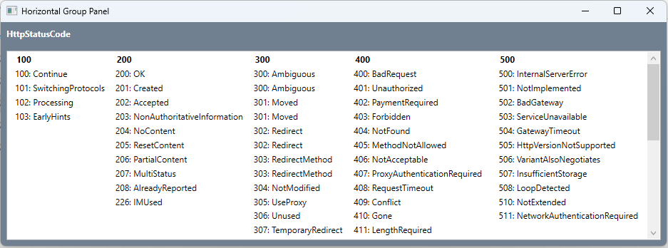

## Horizontal Group Panel




```xml
<GroupStyle>
    <GroupStyle.HeaderTemplate>
        <DataTemplate>
            <Border Background="White">
                <TextBlock Text="{Binding Name}" FontWeight="Bold" Padding="12,2"/>
            </Border>
        </DataTemplate>
    </GroupStyle.HeaderTemplate>
    <GroupStyle.Panel>
        <ItemsPanelTemplate>
            <StackPanel Orientation="Horizontal" />
        </ItemsPanelTemplate>
    </GroupStyle.Panel>
</GroupStyle>
```
