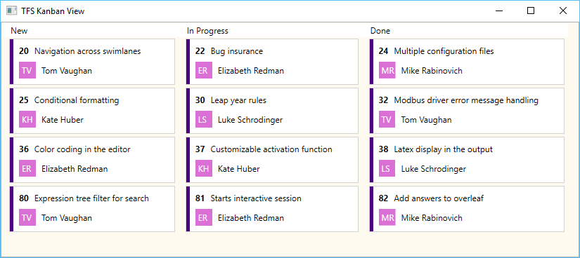

## Kanban




```
<ListBox.GroupStyle>
    <GroupStyle>
        <GroupStyle.HeaderTemplate>
            <DataTemplate>
                <Border Background="White">
                    <TextBlock Text="{Binding Name}" Padding="12,2"/>
                </Border>
            </DataTemplate>
        </GroupStyle.HeaderTemplate>
        <GroupStyle.Panel>
            <ItemsPanelTemplate>
                <StackPanel Orientation="Horizontal" />
            </ItemsPanelTemplate>
        </GroupStyle.Panel>
    </GroupStyle>
</ListBox.GroupStyle>
```