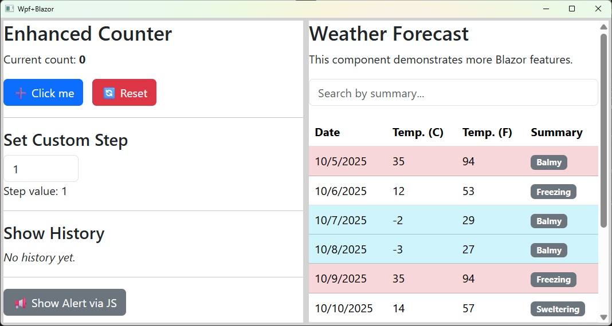

# WPF+Blazor

**This demo project shows how to host Blazor UI pages inside a WPF application.**

It uses the **BlazorWebView** control from `Microsoft.AspNetCore.Components.WebView.Wpf` to embed interactive Blazor components directly within a WPF window, allowing you to combine the strengths of both WPF and Blazor in a single application.

